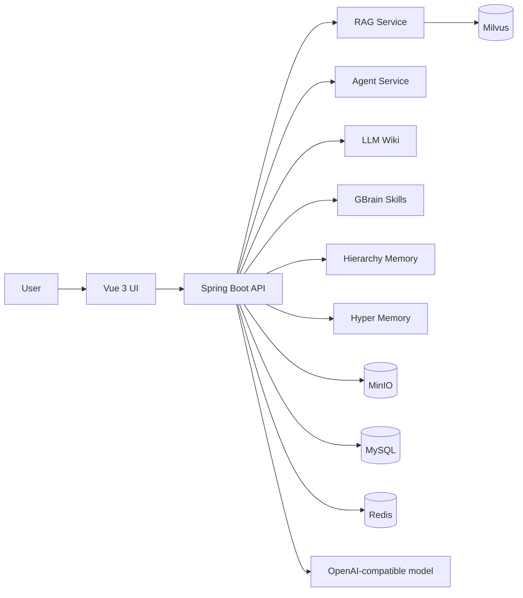

<p align="center">
  <a href="#readme">English</a>
</p>

<h1 align="center">HyperMemory</h1>

<p align="center">
  <em>"A memory operating layer for AI knowledge systems."</em>
</p>

<p align="center">
  
  
  
  
  
  
</p>

<p align="center">
  HyperMemory is the product-oriented final system evolved from CampusRAG-QA. It is no longer limited to campus scenarios.
</p>


## Product Scope

HyperMemory combines several AI knowledge system patterns in one runnable project:

| Layer | Capability |
| --- | --- |
| RAG | Upload documents, create embeddings, retrieve context, answer with an LLM. |
| Agent | Route questions through tool-aware agent logic. |
| LLM Wiki | Turn uploaded knowledge into wiki-like memory pages. |
| GBrain | Add a skill-oriented layer on top of wiki memory. |
| Hierarchy Memory | Combine wiki content with conversation memory. |
| Hyper Memory | Final aggregation layer for longer-lived memory behavior. |

Current RAG retrieval stores each text chunk in MySQL, indexes chunk IDs in Milvus, and hydrates real source text before prompting the model.

## Screenshots

| Desktop | Mode selection |
| --- | --- |
|  |  |

| Mobile |
| --- |
|  |

## Architecture



## Quick Start

```bash
cp .env.example .env
docker compose up -d --build
```

Open:

- Frontend: `http://localhost:3000`
- Backend health: `http://localhost:8080/actuator/health`
- MinIO console: `http://localhost:9001`

Set `OPENAI_API_KEY` in `.env` before expecting real model answers.

## Production-Oriented Defaults

- Vite entrypoint is present through `frontend/index.html`.
- Nginx serves the SPA and proxies `/api` to Spring Boot.
- Runtime secrets and ports are externalized through `.env`.
- Docker Compose has service health checks.
- Spring Boot exposes actuator health probes.
- Upload size is configured for larger knowledge files.

See [Operations Guide](docs/OPERATIONS.md) for mode endpoints, configuration, and hardening notes.

## Roadmap

- Durable memory storage for wiki, hierarchy, and hyper memory.
- Real streaming token output instead of single-event SSE.
- Multi-tenant workspaces and role-based access control.
- Source-grounded answers with citations.
- Background skill scheduling and audit trail.
- Evaluation suite for retrieval quality and memory quality.
