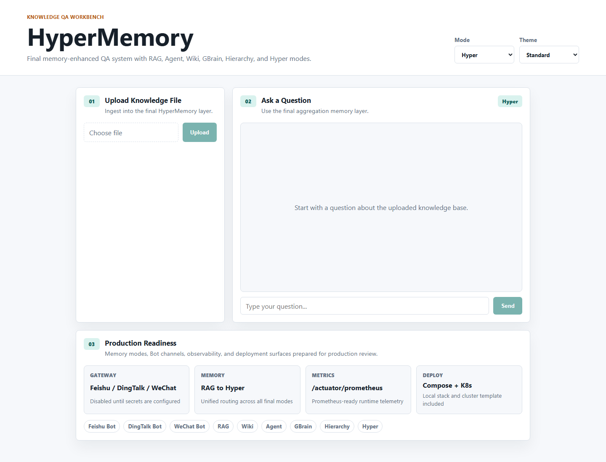
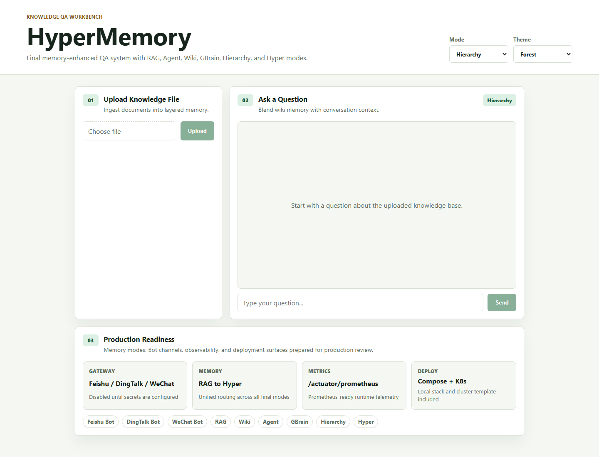
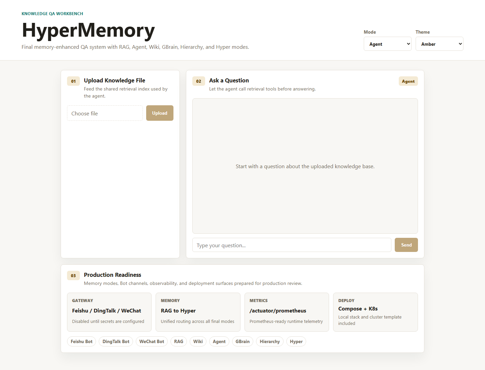
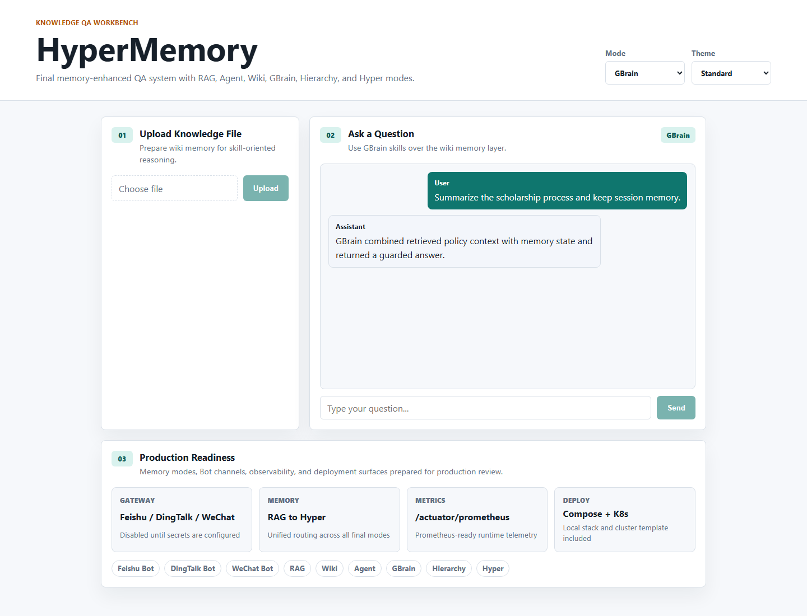
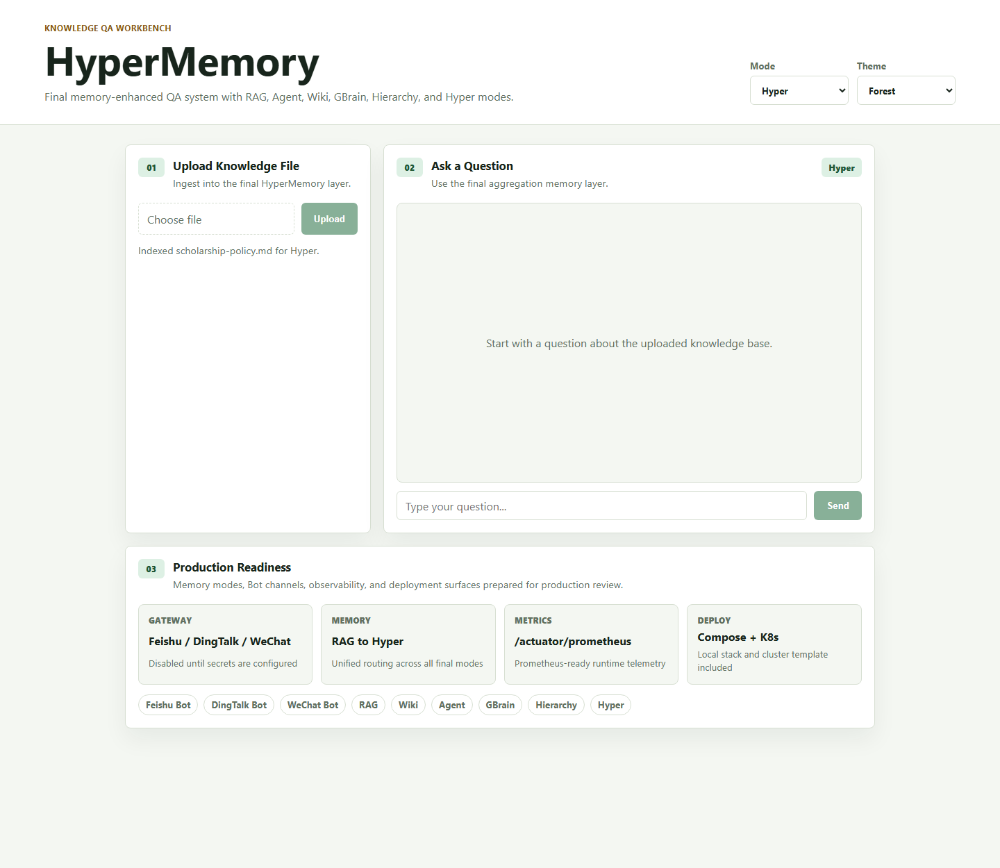
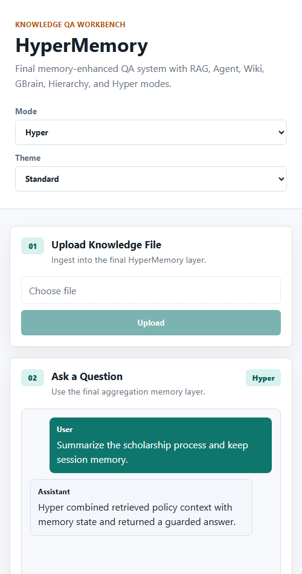
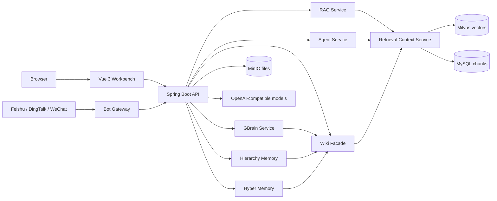

<h1 align="center">HyperMemory</h1>

<p align="center">
  Final memory-enhanced AI knowledge system combining <strong>RAG</strong>, <strong>Agent</strong>, <strong>Wiki</strong>, <strong>GBrain</strong>, hierarchy memory, and hyper memory.
</p>

<p align="center">
  
  
  
  
  
</p>

<p align="center">
  <a href="#quick-start">Quick Start</a> |
  <a href="docs/OPERATIONS.md">Operations</a> |
  <a href="docs/PRODUCTION-ARCHITECTURE.md">Architecture</a> |
  <a href="docs/PRODUCTION-GAPS.md">Production Gaps</a> |
  <a href="docs/MAINTENANCE.md">Maintenance</a> |
  <a href="docs/BOT-INTEGRATION.md">Bot Integration</a> |
  <a href="docs/OPEN_SOURCE_REFERENCES.md">References</a>
</p>

<p align="center">
  
</p>

## Position

HyperMemory is the final repository in the Campus QA family. It keeps the useful ideas from RAG, Agent, LLM Wiki, GBrain, hierarchy memory, and hyper memory in one runnable project while making the remaining production gaps explicit.

| Repository | Role |
| --- | --- |
| `Harzva/CampusRAG-QA` | Baseline RAG + Wiki mode. |
| `Harzva/CampusAgent-QA` | Agent tools, Wiki memory, and GBrain skills. |
| `Harzva/HyperMemory` | Final memory-enhanced system. |

## What Changed In This Cleanup

| Before | Now |
| --- | --- |
| Demo-like frontend title and layout | Product-specific workbench with real mode names. |
| Hardcoded Agent FAQ answers | Agent relies on retrieval tools for knowledge answers. |
| Wiki mode dumped stored pages first | Wiki mode queries the shared retrieval core first. |
| Placeholder GBrain console examples | Deterministic inspection skills with structured names. |
| README described production as if finished | README and production review separate what is done from what remains. |

## Modes

| Mode | Endpoint | Purpose |
| --- | --- | --- |
| RAG | `/api/chat` | Direct grounded QA over retrieved chunks. |
| Agent | `/api/agent/chat` | Tool-using QA over the same retrieval core. |
| LLM Wiki | `/api/wiki/chat` | Wiki-style memory over retrieved chunks. |
| GBrain | `/api/gbrain/chat` | Skill layer over wiki memory. |
| Hierarchy | `/api/hierarchy/chat` | Wiki plus conversation context. |
| Hyper | `/api/hyper/chat` | Final aggregation layer for the demo. |
| Bot Gateway | `/api/bot/{channel}/callback` | Routes normalized Feishu, DingTalk, and WeChat messages. |

## Visual Walkthrough

Six README-owned screenshots show the runnable workbench across final memory modes, production readiness, and mobile layout.

| Dashboard | Hierarchy mode | Agent mode |
| --- | --- | --- |
|  |  |  |

| GBrain conversation | Production readiness | Mobile |
| --- | --- | --- |
|  |  |  |

## Architecture



## Quick Start

```bash
cp .env.example .env
docker compose up -d --build
```

Open:

- Frontend: `http://localhost:3000`
- Backend health: `http://localhost:8080/actuator/health`
- MinIO console: `http://localhost:9001`

Set `OPENAI_API_KEY` in `.env` before expecting model-backed answers.

## Repository Layout

```text
backend/              Spring Boot API and memory services
frontend/             Vue 3 workbench
docs/assets/          README screenshots
docs/OPERATIONS.md    Runtime and endpoint notes
docs/PRODUCTION-ARCHITECTURE.md
docs/PRODUCTION-GAPS.md
docs/MAINTENANCE.md
docs/BOT-INTEGRATION.md
docs/SCREENSHOTS.md
docs/openapi/          API contract templates
deploy/k8s/            Kubernetes deployment template
docs/PRODUCTION-REVIEW.md
SECURITY.md            Security policy and secret-handling notes
docker-compose.yml    Full local runtime stack
.env.example          Runtime configuration template
```

## Production Readiness

See [Production Review](docs/PRODUCTION-REVIEW.md) and [Production Gaps](docs/PRODUCTION-GAPS.md) for the detailed audit. The largest remaining decisions are durable memory persistence, tenant isolation, Bot idempotency, and whether final retrieval should collapse to SQLite-only or keep the current MySQL/Milvus/MinIO stack.
